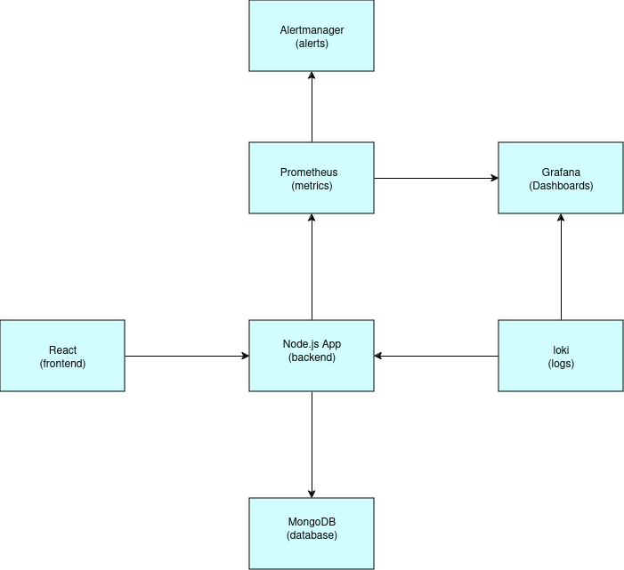
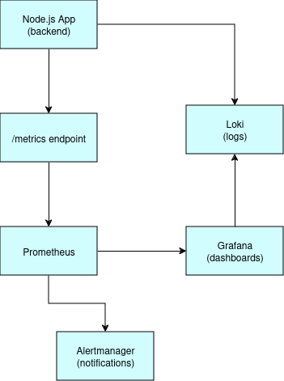

# Architecture Summary

## Overview

The Doctor app is a full-stack web application designed to help manage medical services and health-related features. It includes a Node.js backend connected to a MongoDB database and a React-based frontend. The backend exposes REST APIs for the frontend to consume, and user actions trigger events such as authentication, email notifications, and data storage.

The system is containerized using Docker and orchestrated via Docker Compose, making it portable and easy to deploy.

For observability, the app uses:
- **Prometheus** to scrape metrics exposed by the Node.js backend
- **Grafana** to visualize metrics and logs
- **Loki** to collect and index logs
- **Alertmanager** to send alerts (via Slack and email) based on rules defined in Prometheus

This monitoring stack helps ensure the system remains reliable and provides insight into performance and errors.

## Components

### 1. Frontend (React)
The frontend is built with React and provides the user interface for the Doctor application. It communicates with the backend using HTTP requests to perform actions such as login, signup, and accessing medical data.

### 2. Backend (Node.js + Express)
The backend is developed in Node.js using the Express framework. It exposes RESTful APIs for user and data management, handles authentication, and integrates with external services like SMTP for email notifications.

### 3. MongoDB
MongoDB is used as the database for storing user data, appointments, and other health-related records. It is connected to the Node.js backend using Mongoose.

### 4. Docker & Docker Compose
The entire system (backend, database, monitoring tools) is containerized using Docker. Docker Compose is used to manage multi-container setup and simplify local development and deployment.

### 5. Prometheus
Prometheus scrapes metrics exposed by the Node.js backend (e.g., HTTP requests, memory usage,CPU usage). These metrics are stored and can be queried for performance monitoring.

### 6. Grafana
Grafana is used to visualize data collected by Prometheus and logs collected by Loki. Custom dashboards display metrics such as CPU usage, memory, request rates, and system health.

### 7. Loki
Loki collects logs from the backend and stores them in a structured way. Logs are viewed through Grafana, allowing developers to trace errors or incidents.

### 8. Alertmanager
Alertmanager receives alerts from Prometheus when predefined conditions are met (e.g., app down, high memory usage). It forwards notifications to Slack and email for quick response.

## Interactions

1. **Frontend → Backend**
   - The React frontend sends HTTP requests to the Node.js backend for user authentication, data fetching, and form submissions.
   - Example: when a user logs in, the frontend sends a POST request to the `/login` endpoint.

2. **Backend → MongoDB**
   - The Node.js backend queries or updates data in MongoDB using Mongoose.
   - Example: when a new user signs up, the backend creates a new document in the `users` collection.

3. **Backend → Prometheus**
   - The backend exposes metrics (e.g., `/metrics` endpoint) using `prom-client`.
   - Prometheus regularly scrapes this endpoint to collect data like HTTP request counts, memory usage, and response times.

4. **Prometheus → Alertmanager**
   - When Prometheus detects an alert condition (defined in rules), it sends an alert to Alertmanager.
   - Alertmanager groups and routes these alerts to Slack and email.

5. **Loki → Grafana**
   - Loki collects logs from the backend container.
   - Grafana queries Loki to show logs based on labels and filters (e.g., error logs in real-time).

6. **Prometheus → Grafana**
   - Grafana queries Prometheus to display metrics in custom dashboards.

7. **Developer → Grafana**
   - Developers use Grafana to view both metrics (from Prometheus) and logs (from Loki) for debugging, monitoring, and incident response

## Monitoring & Observability

The system includes an observability stack based on Prometheus, Grafana, Loki, and Alertmanager.

- **Prometheus** scrapes metrics exposed by the Node.js backend, such as request rates, memory usage, and response times.
- **Grafana** visualizes both metrics (from Prometheus) and logs (from Loki) in dashboards to help monitor system health.
- **Loki** collects logs from the backend container. These logs can be filtered and explored via Grafana to trace issues and analyze events.
- **Alertmanager** receives alerts triggered by Prometheus rules. It forwards critical notifications to Slack and email, enabling prompt response to incidents such as high memory usage or service downtime.

This setup helps maintain high availability, fast debugging, and proactive incident handling.

## System Architecture Diagram

---

## Monitoring Flow Diagram

