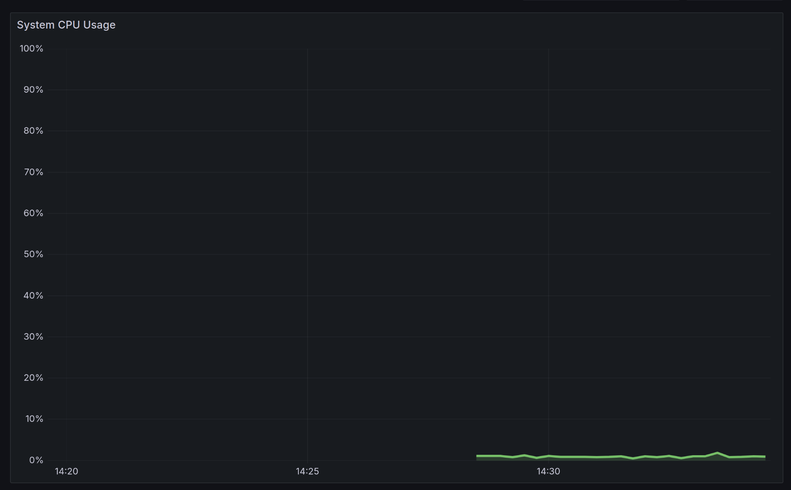

# Grafana Dashboards Documentation

This document summarizes the key Grafana dashboards used for monitoring the Doctor app infrastructure and services.

---

## System CPU Usage Panel

This panel shows the real-time usage of CPU across the system or containerized services.

---

## System Memory Usage Panel

This panel displays memory usage, helping identify spikes and trends over time.

---

## CPU Usage Breakdown Panel

Breakdown of CPU usage by processes or containers.

---

## Memory Usage Distribution

A visual overview (e.g. donut chart) of how memory is allocated.

---

## HTTP Requests Panel

Tracks number and rate of incoming HTTP requests.

---

## Uptime Panel

Shows system or container uptime status and alerts for potential downtime.

---

## Real-Time Logs Panel

Streaming real-time logs collected via Loki, useful for debugging and incident response.

---

## Total Logs Count

Displays the total number of logs captured during the selected period.

---

## Logs Filtered by Level

Shows logs filtered by severity (info, warning, error, etc.).

---

## Real-Time Logs Dashboard Overview

Complete view of the real-time logging dashboard powered by Loki.

---

## Custom Dashboard Overview

This dashboard combines multiple panels (CPU, memory, logs) in one view.

